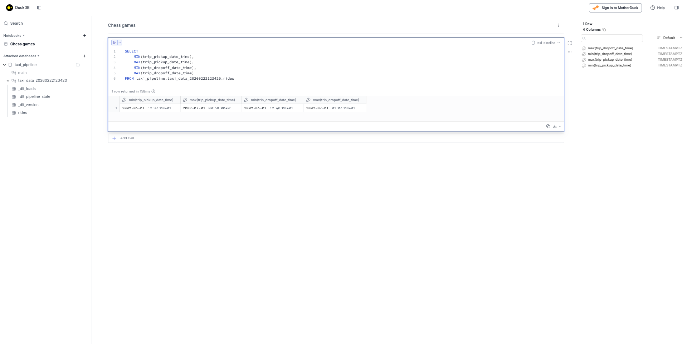
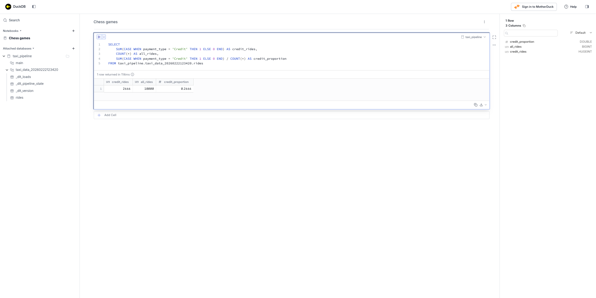
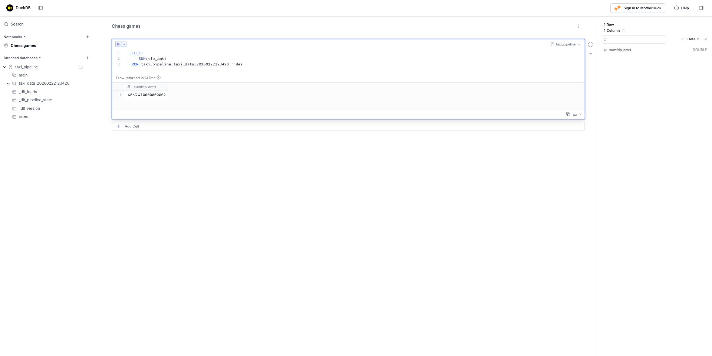

# Homework: Build Your Own dlt Pipeline

For this homework, build a dlt pipeline that loads NYC taxi trip data from a custom API into DuckDB and then answer some questions using the loaded data.

## Data Source

You'll be working with **NYC Yellow Taxi trip data** from a custom API (not available as a dlt scaffold). This dataset contains records of individual taxi trips in New York City.

| Property   | Value                                                                                   |
| ---------- | --------------------------------------------------------------------------------------- |
| Base URL   | `https://us-central1-dlthub-analytics.cloudfunctions.net/data_engineering_zoomcamp_api` |
| Format     | Paginated JSON                                                                          |
| Page Size  | 1,000 records per page                                                                  |
| Pagination | Stop when an empty page is returned                                                     |

## Setup Instructions

The project was created and initialized with this snippet:

```bash
mkdir taxi-pipeline
cd taxi-pipeline

uv init --python 3.11 --directory .
uv add "dlt[workspace]"
uv run dlt init dlthub:taxi_pipeline duckdb

claude mcp add dlt -- uv run --with "dlt[duckdb]" --with "dlt-mcp[search]" python -m dlt_mcp
```

Then, I asked **Claude Code** this:

```
Build a REST API source for NYC taxi data.

API details:
- Base URL: https://us-central1-dlthub-analytics.cloudfunctions.net/data_engineering_zoomcamp_api
- Data format: Paginated JSON (1,000 records per page)
- Pagination: Stop when an empty page is returned. Navigate the pages adding a **page** argument (example: `?page=1`)

Place the code in taxi_pipeline.py and name the pipeline taxi_pipeline.
```

Run your pipeline and iterate with the agent until it works:

```bash
python taxi_pipeline.py
```

---

## Questions

> Once your pipeline has run successfully, use the methods covered in the workshop to investigate the following:
>
> - **dlt Dashboard**: `dlt pipeline taxi_pipeline show`
> - **dlt MCP Server**: Ask the agent questions about your pipeline
> - **Marimo Notebook**: Build visualizations and run queries
>
> We challenge you to try out the different methods explored in the workshop when answering these questions to see what works best for you. Feel free to share your thoughts on what worked (or didn't) in your submission!

Asking my agent to generate queries that I could then check, tweak and execute on my own was my preferred method, as it facilitates checking the results. In each question, I shared the final query that I used to get the answer.

### Question 1: What is the start date and end date of the dataset?

```sql
SELECT
    MIN(trip_pickup_date_time),
    MAX(trip_pickup_date_time),
    MIN(trip_dropoff_date_time),
    MAX(trip_dropoff_date_time)
FROM taxi_pipeline.taxi_data_20260222123420.rides
```

- **2009-06-01 to 2009-07-01**



### Question 2: What proportion of trips are paid with credit card?

This query can be used to answer the question:

```sql
SELECT
    SUM(CASE WHEN payment_type = 'Credit' THEN 1 ELSE 0 END) AS credit_rides,
    COUNT(*) AS all_rides,
    SUM(CASE WHEN payment_type = 'Credit' THEN 1 ELSE 0 END) / COUNT(*) AS credit_proportion
FROM taxi_pipeline.taxi_data_20260222123420.rides
```

- **26.66%**



### Question 3: What is the total amount of money generated in tips?

```sql
SELECT
    SUM(tip_amt)
FROM taxi_pipeline.taxi_data_20260222123420.rides
```

- **$6,063.41**



---

## Submitting the solutions

- Form for submitting: https://courses.datatalks.club/de-zoomcamp-2026/homework/dlt
- Deadline: See the website

## Tips

- The API returns paginated data. Make sure your pipeline handles pagination correctly.
- If the agent gets stuck, paste the error into the chat and let it debug.
- Use the dlt MCP server to ask questions about your pipeline metadata.
