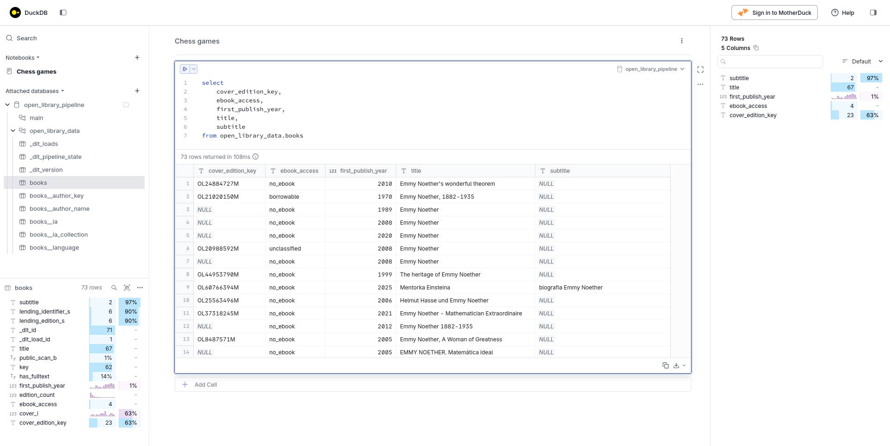
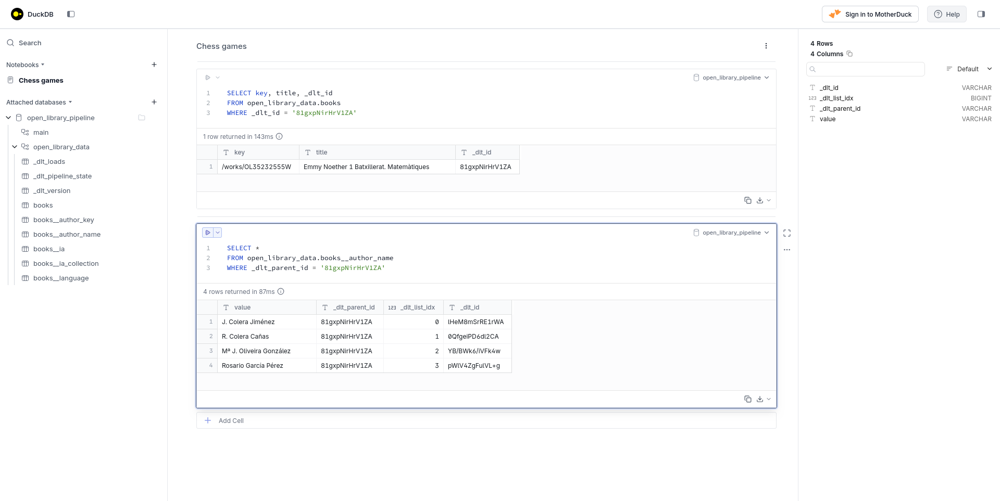
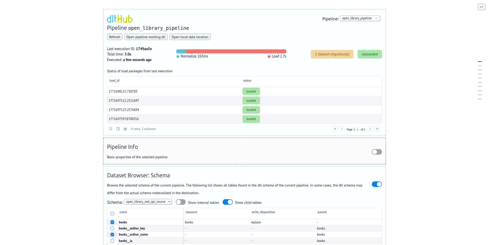
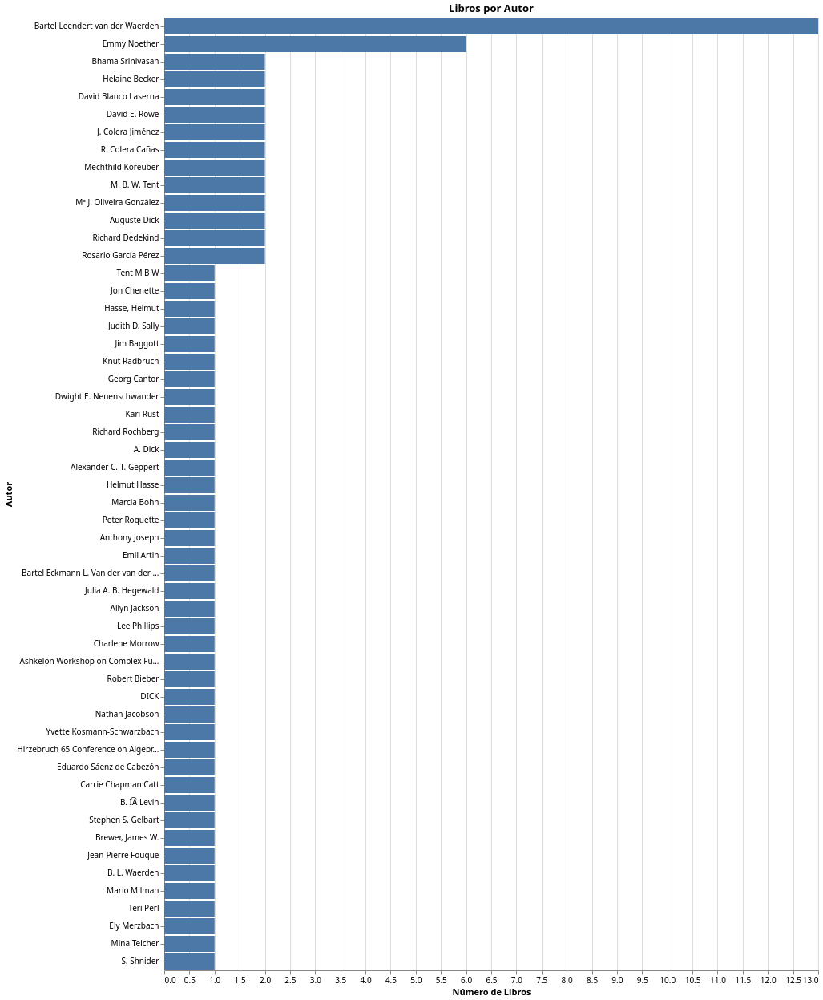
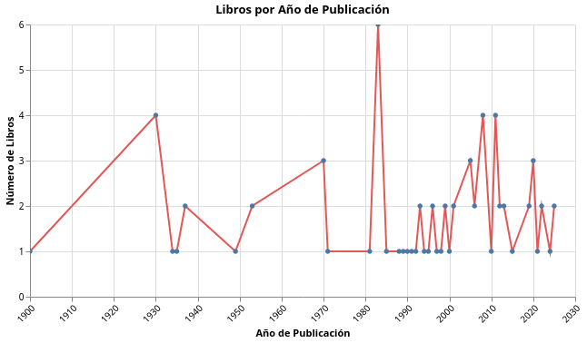

# Workshop: **Data Ingestion from an API with DLT**

## Original Resources

- Original video (in English): **AI Assisted Data Ingestion with dlt**
- Workshop presentation (in English): **From APIs to Warehouses**

---

## Session Objectives

During this session, we will learn how to import data from an API that serves unstructured data — such as the OpenLibrary API — into a structured data warehouse using **dlt**.

---

## What is dlt?

> “dlt (data load tool) is an open-source Python library that loads data from often messy data sources into well-structured, real-time updated datasets. It automates tedious data engineering tasks with features such as schema inference, data normalization, and incremental loading.”

**Source:** dltHub website

---

## What does the OpenLibrary API provide?

From the OpenLibrary API, we will use the **book search service**.  
This API allows you to search for books, authors, and other resources within the Open Library catalog and retrieve the results in JSON format.

It is one of the most comprehensive and convenient ways to retrieve bibliographic data because:

- It returns multiple results in a single request.
- It includes information about:
  - The **work**: author information, first publication year, etc.
  - The **edition**: title, identifiers, covers, etc.
- It provides reusable author identifiers.
- It may include book availability information.

---

## Basic Project URLs

- **Base URL:** https://openlibrary.org
- **Main Endpoint:** https://openlibrary.org/search.json

---

## Request Format

Requests are made using **HTTP GET**.  
Simply append `.json` to the search URL.

---

## Query Parameters

| Parameter   | Description                 |
| ----------- | --------------------------- |
| `q`         | Free-text search.           |
| `title`     | Filter by title.            |
| `author`    | Filter by author.           |
| `subject`   | Filter by subject or topic. |
| `isbn`      | Filter by ISBN.             |
| `publisher` | Filter by publisher.        |
| `language`  | Filter by language.         |
| `page`      | Page number of results.     |
| `limit`     | Number of results per page. |
| `sort`      | Sort results.               |

Common values for the `sort` parameter:

- `new`
- `old`
- `rating`
- `editions`

### Pagination

Pagination is controlled using:

- `page` → page number
- `limit` → results per page

---

## Examples

**Search by free text:**

https://openlibrary.org/search.json?q=the+lord+of+the+rings

**Search by title:**

https://openlibrary.org/search.json?title=the+lord+of+the+rings

**Search by author:**
https://openlibrary.org/search.json?author=tolkien

**Search with pagination:**

---

## Response Format

The response is a JSON object containing search metadata and a list of documents.

---

## Main Fields

| Field      | Description                         |
| ---------- | ----------------------------------- |
| `numFound` | Total number of results.            |
| `start`    | Index of the first returned result. |
| `docs`     | List of results.                    |

---

## Common Fields Inside `docs`

| Field                | Description               |
| -------------------- | ------------------------- |
| `key`                | Work identifier.          |
| `title`              | Title.                    |
| `author_name`        | List of authors.          |
| `author_key`         | Author identifiers.       |
| `first_publish_year` | First publication year.   |
| `edition_count`      | Number of editions.       |
| `isbn`               | List of associated ISBNs. |
| `cover_i`            | Cover identifier.         |
| `subject`            | Subjects or topics.       |
| `language`           | Available languages.      |

The `author_key` identifiers can be used to retrieve detailed author information via the Authors API.

## Installing dlt

To start our project with **dlt**, we first need to make sure we have everything we need.

### Installing uv

As with any Python project, there are several ways to install and manage dependencies.  
In this article, we will use **uv**, so if you don’t already have it installed, run:

```bash
curl -LsSf https://astral.sh/uv/install.sh | sh
```

### Creating a Python 3.11 Environment

Create a directory called `openlibrary-pipeline` for the project:

```bash
mkdir -p pipelines/openlibrary-pipeline
cd pipelines/openlibrary-pipeline
```

Make sure to initialize it with Python 3.11:

```bash
uv init --python 3.11 --directory .
```

## Initializing the dlt Project

Now we install **dlt** with the set of dependencies recommended for local development (which includes `duckdb`, `marimo`, `pyarrow`, and `fastmcp`).

```bash
uv add "dlt[workspace]"
```

Next, we initialize our workspace by specifying:

Data source: choose from more than 10,000 predefined sources.

Destination: choose from the supported destinations.

In our case:

Source: open-library

Destination: DuckDB

```bash
uv run dlt init dlthub:open_library duckdb
```

During the process, you will be asked which AI assistant you use with your IDE.
The available options are: amp, codex, claude, cody, cline, cursor, continue, windsurf, copilot.

In our case, we selected claude.

## Creating the Data Flow with Claude

At this point, in addition to initializing our **dlt** project, we also have a `CLAUDE.md` file that instructs Claude on how to work within the project.

To get started quickly, we can open **Claude (Claude Code)** and provide the following prompt:

> Please generate a REST API source for the Open Library API as specified in @open_library-docs.yaml.  
> Start with the **books** endpoint(s) and omit incremental loading for now.  
> Place the code in `open_library_pipeline.py` and name the pipeline `open_library_pipeline`.  
> If the file already exists, use it as a starting point.  
> Do not add or modify any other files.  
> Use `@dlt rest api` as a tutorial reference.  
> After adding the endpoints, allow the user to execute the pipeline with `uv run python open_library_pipeline.py` and wait for further instructions.
> With this, Claude generated an almost fully functional `open_library_pipeline.py` file for us.  
> We only need to make minimal adjustments if necessary.

> **Note**
>
> At first, by following the steps described so far, we were able to get Claude Code to generate a working data pipeline.
> However, we can provide a small additional boost by installing the **dlt MCP server**.

```bash
claude mcp add dlt -- uv run --with "dlt[duckdb]" --with "dlt-mcp[search]" python -m dlt_mcp
```

## Running the Data Flow

Once we have created our data flow, we can execute it like a standard Python script:

```bash
uv run python open_library_pipeline.py
```



## Normalization

When running a data pipeline, **dlt** creates additional internal tables.  
This is one of the reasons why it is particularly useful for importing data from structures such as API responses, which may contain nested objects and arrays.

In our case, this is an example of an item returned by the OpenLibrary API:

```json
{
  "author_key": ["OL12755009A", "OL12755011A", "OL12755010A", "OL10652074A"],
  "author_name": [
    "J. Colera Jiménez",
    "R. Colera Cañas",
    "Mª J. Oliveira González",
    "Rosario García Pérez"
  ],
  "cover_edition_key": "OL47633096M",
  "cover_i": 14260053,
  "ebook_access": "no_ebook",
  "edition_count": 2,
  "first_publish_year": 2022,
  "has_fulltext": false,
  "key": "/works/OL35232554W",
  "public_scan_b": false,
  "title": "Emmy Noether 1 Batxillerat. Matemàtiques"
}
```

Nested data structures like this allow, for example, having four authors associated with a single book.  
To make these structures compatible with relational databases such as DuckDB, **dlt** automatically performs a normalization process that creates multiple tables without requiring any manual intervention.

> **Note**
>
> For more information, see the **dlt destination tables** documentation (in English).

---

## Additional Fields

In the `books` table, we can see two fields that were added by **dlt**:

- `_dlt_load_id`: identifies the load in which the record was processed, linking records in `books` to those in `_dlt_loads`.
- `_dlt_id`: uniquely identifies each record, allowing it to be related to other tables.

```sql
SELECT key, title, _dlt_id
FROM open_library_data.books
WHERE _dlt_id = '81gxpNirHrV1ZA'
```

| key                | title                                    | \_dlt_id       |
| ------------------ | ---------------------------------------- | -------------- |
| /works/OL35232555W | Emmy Noether 1 Batxillerat. Matemàtiques | 81gxpNirHrV1ZA |

---

## Related Tables

In addition, **dlt** creates related tables based on categorical fields.

For example, the authors found in the `author_name` field are inserted into a specific table called `books__author_name`.  
They are linked using a column named `_dlt_parent_id`, which contains the `_dlt_id` of the corresponding book.

```sql
SELECT *
FROM open_library_data.books__author_name
WHERE _dlt_parent_id = '81gxpNirHrV1ZA'
```



## Process Summary

In summary, when we execute a data pipeline in **dlt**, we do so by running:

pipeline.run(source)

What happens when we do this is equivalent to:

- pipeline.extract(source): extracts the data by querying the corresponding API,
- pipeline.normalize(): normalizes the data to adapt it into a structured format,
- pipeline.load(): loads the data into the database.

## Inspecting a Data Pipeline

## Inspecting the Extraction

In addition to running a data pipeline, we can also inspect it in different ways. For example, we can obtain metrics about the extracted data by inspecting what the `pipeline.extract` method returns.

To do this, we start a Python interpreter session:

```bash
cd pipelines/openlibrary-pipeline
uv run python
```

And then run:

```python
from open_library_pipeline import pipeline, open_library_rest_api_source

extracted = pipeline.extract(open_library_rest_api_source())

# Identificamos el identificador de la carga
load_id = extracted.loads_ids[-1]

# Obtenemos sus métricas
load_metrics = extracted.metrics[load_id][0]

# Obtenemos las métricas para cada recurso
resource_metrics = load_metrics['resource_metrics']

for resource, metrics in resource_metrics.items():
    print(f"Recurso: {resource}\n - Registros: {metrics.items_count}")

```

With this, we would obtain:

Resource: books

- Records: 73

## Inspecting the Data Structures

We can also inspect the data model of our data pipeline by querying `pipeline.dataset`.

To do this, from an interactive Python session, run:

```python
from open_library_pipeline import pipeline, open_library_rest_api_source

dataset = pipeline.dataset()
dataset.tables
```

output

```json
[
  "books",
  "books__author_key",
  "books__author_name",
  "books__ia",
  "books__ia_collection",
  "books__language",
  "_dlt_version",
  "_dlt_loads",
  "_dlt_pipeline_state"
]
```

# dltHub Workspace

## Step 1: Data Loading with LLM Scaffolding

In the article _Practical Guide to Building LLM-Native Data Pipelines with the dltHub Workspace_, a working methodology is presented that starts from prebuilt “scaffolds.” These scaffolds simplify the work of LLMs by providing them with part of the data pipelines already constructed.

They refer to this strategy as the “IKEA moment of data engineering.”

## Step 2: Ensuring Quality

The dltHub Workspace provides inspection tools that make it easier to perform checks across all aspects of our data pipelines: from schemas, to the data itself, and even their final destinations.

These tools include:

- dlt Dashboard
- dlt MCP Server
- dlt CLI

## dlt Dashboard

The dlt Dashboard is the tool that allows us, among other things, to:

- Check the status of our data pipeline
- Inspect our schemas
- Review the state of incremental loads
- Run queries

## Installation

Before installing the dashboard, we must make sure that **marimo** is up and running.

```bash
uv add marimo
```

Then, we will be able to open the control panel by running:

```bash
uv run dlt dashboard
```



When the dashboard opens, the first thing we need to do is select the data pipeline we want to analyze.

Alternatively, we can open the dashboard by directly loading our pipeline:

dlt pipeline open_library_pipeline show

---

## Step 3: Generate Transformations and Reports

For report generation, dlt proposes combining **marimo notebooks** with the **ibis** library.

A good summary of what marimo notebooks are can be found on their official website:

> "Transform data, train models, and run SQL queries with marimo: it works like an AI-native reactive notebook, stored as reproducible Python and compatible with Git. Run it seamlessly as scripts and applications. Fully open source."

Source: marimo.io

Similarly, there is no better introduction to the ibis library than the one provided by its own creators:

> "An open-source dataframe library compatible with any data system.  
> Use the same API across more than 20 backends.  
> Fast local dataframes with built-in DuckDB (default), Polars, or DataFusion.  
> Iterate locally and deploy remotely by changing a single line of code.  
> Compose dataframe code in SQL and Python, bridging data engineering and data science."

Source: ibis-project.org

The proposal on how to combine these two tools is explained in the article (in English) _Explore your data with Marimo_, and it begins with installing the required dependencies:

```bash
uv add marimo "ibis-framework[duckdb]" altair
```

````bash
With this, we were able to compose a request for Claude Code:

Using the documentation available at:

https://dlthub.com/docs/general-usage/dataset-access/marimo

Create a dashboard with:

- A bar chart showing the number of books per author
- A line chart showing the number of books by publication year

Claude responded by creating a basic but functional dashboard.

Claude responded by creating a basic but functional dashboard.

● The file `dashboard.py` was created. To run it:

  marimo edit dashboard.py

Or in read-only mode (deployed app):

  marimo run dashboard.py

---

## Dashboard Structure

### Cell 1 — Imports
- marimo
- ibis
- altair

### Cell 2 — DuckDB Connection
```python
con = ibis.connect("duckdb://open_library_pipeline.duckdb")
Cell 3 — Bar Chart (Books per Author)

SQL query joining books with books__author_name via _dlt_parent_id = _dlt_id

Counts unique books (key) per author

Horizontal bars sorted from highest to lowest

Cell 4 — Line Chart (Books per Year)

SQL query on books.first_publish_year

Counts books per year, filtering out null values

Line chart with points, X-axis formatted as integer (no decimals)

Both charts are interactive thanks to mo.ui.altair_chart — you can hover to see tooltips and select points/bars.
✻ Worked for 3m 52s

````

By simply adding the `uv run` prefix to the commands suggested by Claude Code, we were able to open and interact with the dashboard.

---

## Reviewing the Dashboard Code

The notebook generated by Claude Code starts by importing dependencies, followed by initializing the database connection:

```python
import marimo as mo
import ibis
import altair as alt

con = ibis.connect("duckdb://open_library_pipeline.duckdb")
```

It then defines two separate cells, one for each report.

First, to generate the "books per author" chart, it prepared an SQL query joining the books and authors tables, and displayed the results using altair_chart.

```python
df_authors = con.sql("""
    SELECT
        an.value AS author_name,
        COUNT(DISTINCT b.key) AS book_count
    FROM open_library_data.books b
    JOIN open_library_data.books__author_name an
        ON an._dlt_parent_id = b._dlt_id
    GROUP BY an.value
    ORDER BY book_count DESC
""").to_pandas()

mo.ui.altair_chart(
    alt.Chart(df_authors)
    .mark_bar(color="#4C78A8")
    .encode(
        y=alt.Y("author_name:N", sort="-x", title="Autor"),
        x=alt.X("book_count:Q", title="Número de Libros"),
        tooltip=[
            alt.Tooltip("author_name:N", title="Autor"),
            alt.Tooltip("book_count:Q", title="Libros"),
        ],
    )
    .properties(
        title="Books by Author",
        height=alt.Step(22),
    )
)
```



Secondly, to generate the "books by publication year" chart, it followed the same strategy, this time querying only the `books` table.

It prepared an SQL query aggregating the number of books by `first_publish_year`, filtered out null values, and rendered the result as a line chart using `altair_chart`.

```python
df_years = con.sql("""
    SELECT
        first_publish_year,
        COUNT(DISTINCT key) AS book_count
    FROM open_library_data.books
    WHERE first_publish_year IS NOT NULL
    GROUP BY first_publish_year
    ORDER BY first_publish_year
""").to_pandas()

mo.ui.altair_chart(
    alt.Chart(df_years)
    .mark_line(point=True, color="#E45756")
    .encode(
        x=alt.X(
            "first_publish_year:Q",
            title="Año de Publicación",
            axis=alt.Axis(format="d", labelAngle=-45),
        ),
        y=alt.Y("book_count:Q", title="Número de Libros"),
        tooltip=[
            alt.Tooltip("first_publish_year:Q", title="Año", format="d"),
            alt.Tooltip("book_count:Q", title="Libros"),
        ],
    )
    .properties(
        title="Books by Publication Year",
        width=600,
        height=300,
    )
)
```


