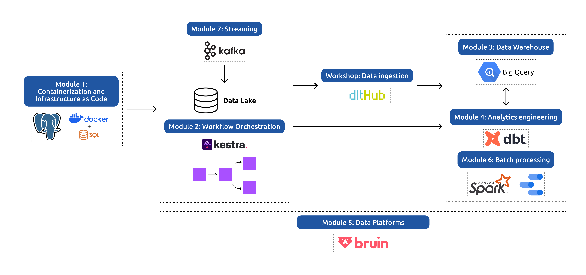

# Data Engineering Zoomcamp: A Free 9-Week Course on Data Engineering Fundamentals

Master the fundamentals of data engineering by building an end-to-end data pipeline from scratch. Gain hands-on experience with industry-standard tools and best practices.

